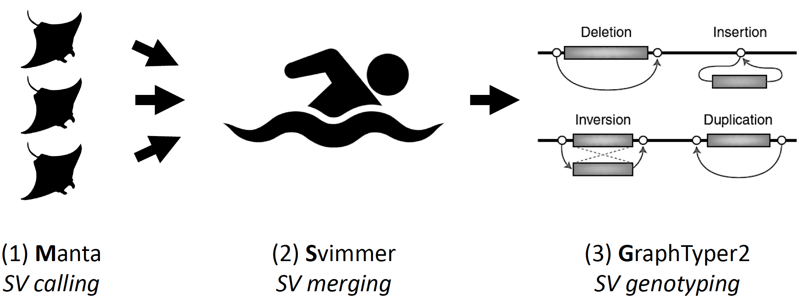

MSG - Wrapper for SV calling and genotyping
===========================================

MSG is an open-source wrapper that makes use of the powerful structural variant caller [**M**anta](https://github.com/Illumina/manta) ([Chen et al., 2016](https://academic.oup.com/bioinformatics/article/32/8/1220/1743909)) for identifying germline and somatic SVs in sequencing data of unpaired samples, as well as the [**S**vimmer](https://github.com/DecodeGenetics/svimmer) and [**G**raphtyper](https://github.com/DecodeGenetics/graphtyper) frameworks for SV merging and genotyping, by use of variation graphs ([Eggertson et al., 2017](https://www.nature.com/articles/ng.3964); [Eggertson et al., 2019](https://www.nature.com/articles/s41467-019-13341-9)).

This workflow:
* facilitates high-resolution SV discovery, breakpoint reassembly, genotyping and variant allele frequency inference from Illumina paired-end data
* is highly suitable the genomic studies of asexually evolving genomes, such as the somatic tracing of cancer and normal tissue clones
* has been tested extensively on >512 Mb marsupial chromosomes (with great support from Hannes Eggertson)
* follows the recommendations by [Eggertson et al., 2019](https://www.nature.com/articles/s41467-019-13341-9)
* has recently been employed to study structural variation across hundreds of humans ([Almarri et al., 2020](https://doi.org/10.1016/j.cell.2020.05.024))

In the Transmissible Cancer Group, we rely on this pipeline because of our observation of *low false-negative genotyping rates* with respect to input SV sets across samples, in addition to reliable variant allele frequency estimates. MSG is a wrapper script written in GNU Bash, and has been tested on Ubuntu (18.04) systems. It should work well on any Linux distribution.

---

## Dependencies

The following tools/scripts need to be installed and placed in your $PATH environment, in addition to Python v2.6+, tabix, vcf-sort and bgzip:
* [Manta v1.6.0](https://github.com/Illumina/manta/releases/tag/v1.6.0)
* [Manta v1.6.0 convertInversion.py](https://github.com/Illumina/manta/blob/master/src/python/libexec/convertInversion.py)
* [svimmer v0.1](https://github.com/DecodeGenetics/svimmer/releases/tag/v0.1)
* [Graphtyper v2.5.1](https://github.com/DecodeGenetics/graphtyper/releases/tag/v2.5.1)

---

## Contact

This wrapper was written by Max Stammnitz, Transmissible Cancer Group (2020), with Unix inspiration from Adrian Baez-Ortega, Wellcome Sanger Institute (@baezortega) and svimmer/Graphtyper testing support from Hannes Eggertson, deCODE Genetics (@hannespetur). Please get in touch if there are any issues: maxrupsta {at} gmail.com
